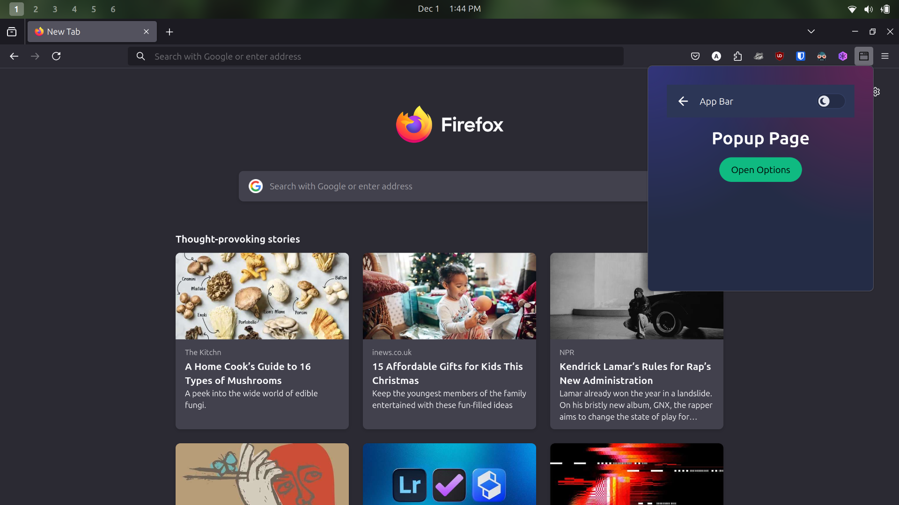
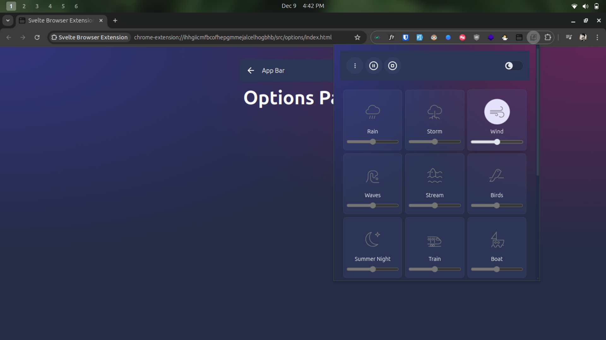
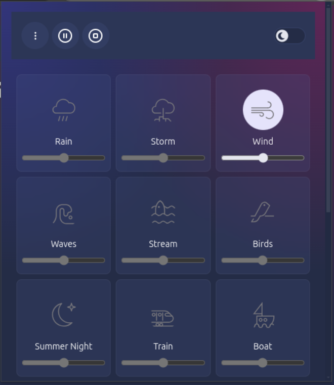

# Noise Blanket

#### An extension to help improve your focus & increase your productivity by listening to sounds of nature. Or just fall asleep in a noisy environment.

This extension is made using [Svelte Extension Template](https://github.com/ankur700/svelte-extension-template)

<!-- |                         Firefox                          |                         Chromium / Edge                         |
| :------------------------------------------------------: | :-------------------------------------------------------------: |
|  |  | -->

This extension creates offline document to play audio in the background even after the extension popup window is closed. You can also add custom audio by providing audio src url in the prompt when asked.

## Usage

1. Clone the repository `git clone https://github.com/ankur700/svelte-extension-template.git`
2. Run `pnpm install`
3. Run `pnpm run watch` to start a dev server with HMR or `pnpm run build` to build for production

## Install
1. Run `pnpm run build` to build for production, extension files will be inside dist folder in the project directory.
2. open chrome extensions page by typing `chrome://extension` in chrome url bar.
3. Click the Load Unpacked button on the top left corner.
4. Select the dist folder from the project directory.
5. Optionally pin the extension to the toolbar for easier access.

## Credits
Developed by [Ankur Singh](https://github.com/ankur700).

## Inspiration
This project is highly ispired by [Blanket](https://github.com/rafaelmardojai/blanket) app for linux.

## Related Projects
- [feeltheblow](https://feeltheblow.web.app/) - Web App inspired by Blanket
- [Soothing Noise Player](https://f-droid.org/en/packages/ie.delilahsthings.soothingloop/) - Android app inspired by Blanket
- [Blanket Web](https://apps.roanapur.de/blanket/) - Web clone of Blanket
